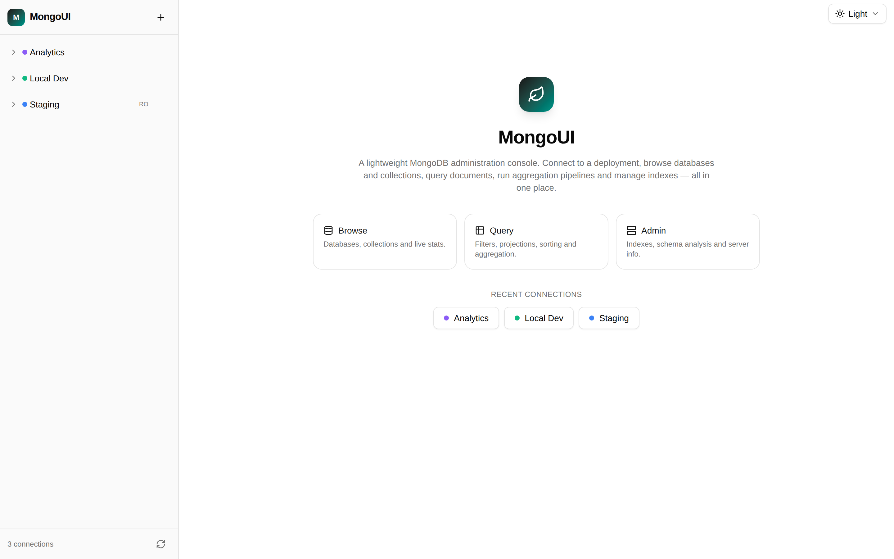
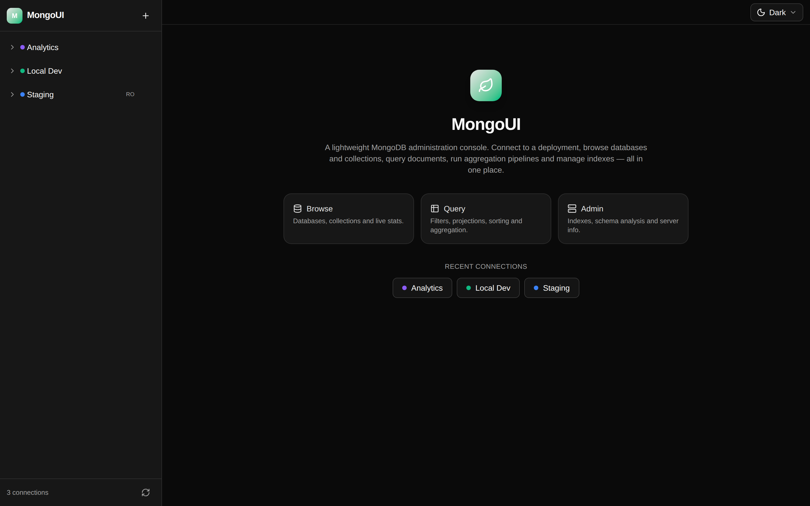
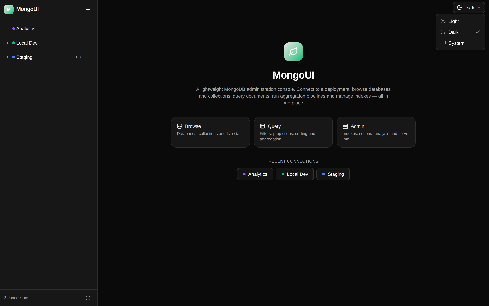

# MongoUI

一个轻量的 MongoDB 可视化管理工具（类似 Navicat / MongoDB Compass 的简化版）。

- **后端**：Go + [chi](https://github.com/go-chi/chi) + 官方 [mongo-go-driver](https://github.com/mongodb/mongo-go-driver)
- **前端**：React 19 + TypeScript + Vite + Tailwind CSS v4 + [shadcn/ui](https://ui.shadcn.com/)（Radix UI）
- 前端构建产物通过 `go:embed` 嵌入 Go 二进制，**单文件部署**，无需额外静态服务器

## 界面预览

| 明亮主题 | 暗黑主题 |
| --- | --- |
|  |  |

右上角的主题切换器支持 **Light / Dark / System** 三种模式，选择会保存在浏览器（`localStorage`），跟随系统模式会随操作系统实时变化：



## 功能

| 模块 | 能力 |
| --- | --- |
| 连接管理 | 新增 / 编辑 / 删除连接、连通性测试、连接 / 断开、只读模式、颜色标记，连接配置持久化到本地 JSON |
| SSH 隧道 | 通过跳板机 / 堡垒机连接内网 MongoDB（密码或私钥认证，可选 known_hosts 严格校验） |
| 数据浏览 | 数据库 / 集合树形导航，数据库大小、集合列表 |
| 文档操作 | 过滤、排序、投影、分页；插入（支持批量数组）、整文档编辑替换、单条 / 批量 / 按条件删除；行选择批量删除、复制 JSON |
| 聚合管道 | 多行 JSON 编辑器 + 常用模板，表格 / JSON 两种结果视图 |
| SQL 查询 | 用 SQL 查询 MongoDB，自动翻译为 find / aggregation，支持 WHERE / IN / LIKE / GROUP BY / HAVING / DISTINCT / 聚合函数，并展示生成的 MQL |
| 索引 | 查看索引（键、唯一、稀疏、TTL、部分索引等）、创建、删除 |
| Schema 分析 | 抽样文档统计字段覆盖率与类型分布 |
| 统计信息 | `collStats` / `dbStats` 关键指标卡片 + 原始 JSON |
| 服务器信息 | 版本、构建信息、运行时长、数据库总大小 |
| 数据管理 | 创建 / 删除数据库、创建 / 删除集合（含 capped 选项） |
| 主题 / i18n | 明亮 / 暗黑 / 跟随系统三种模式；中文 / English 双语，顶栏切换并自动跟随浏览器语言，偏好保存在浏览器 |
| 运维 | 守护进程后台运行（`-daemon` / `-stop` / `-status`）、一键安装脚本、`mongoui update` 自更新 |
| 浏览器 Agent | WebMCP（`navigator.modelContext`）+ `window.mongouiAgent`，把连接 / 查询 / 聚合 / 索引等操作暴露给浏览器内 agent，**默认关闭**、需显式开启 |
| MCP | 内置 Model Context Protocol server（stdio / HTTP），把连接、查询、聚合、SQL、增删改、索引等暴露给外部 Agent；支持整体只读模式 |

所有 BSON 值均以 **MongoDB Extended JSON**（relaxed 模式）在前后端之间传输，因此 `ObjectId`、`Date`、`Decimal128`、`Long`、`Binary` 等类型都能无损保留：

```json
{ "_id": { "$oid": "507f1f77bcf86cd799439011" }, "createdAt": { "$date": "2024-01-01T00:00:00Z" } }
```

## SQL 查询

集合视图新增 **SQL** 标签页，可以直接用 SQL 查询 MongoDB：编辑器带语法高亮（关键字 / 函数 / 字符串 / 数字 / 注释）与自动补全（关键字 / 函数 / 集合名 / 字段名），查询会被翻译成 find / aggregation 执行，并在界面里展示生成的 MQL（方便学习与调试）。按 Ctrl/⌘ + Enter 运行。

```sql
SELECT status, COUNT(*) AS n, SUM(total) AS revenue
FROM orders
WHERE total > 0
GROUP BY status
HAVING n > 1
ORDER BY revenue DESC
LIMIT 20
```

支持的范围：

- `SELECT` / `SELECT DISTINCT`，字段别名 `AS`
- `WHERE`：`= != <> > >= < <=`、`IN` / `NOT IN`、`LIKE` / `NOT LIKE`、`IS [NOT] NULL`、`AND` / `OR` / `NOT`、括号
- `ORDER BY ... [ASC|DESC]`、`LIMIT n [OFFSET m]`（也支持 MySQL 的 `LIMIT m, n`）
- `GROUP BY` / `HAVING`，聚合函数 `COUNT / SUM / AVG / MIN / MAX`
- 点号字段路径（如 `address.city`）

执行接口为 `POST /api/connections/{id}/databases/{db}/sql`（body `{ query, limit? }`），响应包含 `documents`、`columns` 以及翻译后的 `mql`。

## URL 路由与状态保持

当前视图会写进 URL，刷新、分享链接、浏览器前进/后退都能恢复：

| 视图 | URL |
| --- | --- |
| 首页 | `/` |
| 连接概览 | `/connections/{connectionId}` |
| 集合视图 | `/connections/{connectionId}/databases/{db}/collections/{collection}` |
| 集合标签页 | 上表 URL 后追加 `?tab=documents\|sql\|aggregation\|indexes\|schema\|stats` |

- 直接打开深链接会按需自动连接该连接，并在左侧树里自动展开定位到对应集合。
- 侧边栏的展开状态保存在 `localStorage`，刷新后保持。
- 主题与浏览器 Agent 开关同样保存在 `localStorage`。

## 快速开始

### 环境要求

- Go 1.22+
- Node.js 20+
- 一个可访问的 MongoDB（本地、Docker 或 Atlas 均可）

### 生产模式（单二进制）

```bash
make build     # 构建前端 → 复制到 backend/web/dist → 编译 Go
make run       # 默认监听 :8080，数据目录 ./data
```

然后打开 <http://localhost:8080>。

### 开发模式（前后端分离）

```bash
make install        # 安装前端依赖

# 终端 1：后端（:8080）
make dev-backend

# 终端 2：前端（:5173，已配置 /api 代理到 :8080）
make dev-frontend
```

打开 <http://localhost:5173>。

### 本地起一个 MongoDB 测试

```bash
make docker-mongo   # docker run -p 27017:27017 mongo:8
```

## Docker

镜像内置前端，单容器即可运行；连接配置持久化在 `/data` 卷。

```bash
docker build -t mongoui .
docker run -d --name mongoui -p 8080:8080 -v mongoui-data:/data mongoui

# 或使用 compose
docker compose up -d
```

生产使用建议顺带保护 MCP 端点：

```bash
docker run -d -p 8080:8080 -v mongoui-data:/data \
  -e MONGOUI_MCP_TOKEN=change-me \
  mongoui
```

推送 `v*` tag 时 GitHub Actions 会自动构建并发布镜像到 GHCR：`ghcr.io/dolphinzzv/mongoui`。

> 容器内连接宿主机上的 MongoDB：Linux 下用 `--network host`，或把连接串指向宿主机 IP；Docker Desktop 可用 `host.docker.internal:27017`。

## 一键安装（从 GitHub Releases）

无需 Go/Node 环境，直接下载对应平台的预编译二进制（已内嵌前端）：

```bash
curl -fsSL https://raw.githubusercontent.com/dolphinZzv/mongoUI/main/scripts/install.sh | sh
```

指定版本 / 目录 / 顺便装 systemd 服务：

```bash
# 指定版本与安装目录
curl -fsSL https://raw.githubusercontent.com/dolphinZzv/mongoUI/main/scripts/install.sh \
  | sh -s -- --version v0.2.0 --dir "$HOME/.local/bin"

# 或先下载脚本再执行（避免管道问题）
curl -fsSL -o install.sh https://raw.githubusercontent.com/dolphinZzv/mongoUI/main/scripts/install.sh
sh install.sh --dir /usr/local/bin --service
```

脚本会自动识别 `linux/darwin` × `amd64/arm64`，下载归档并用 `checksums.txt` 校验 SHA-256。

## 后台运行（守护进程）

Unix 上可以让服务在后台常驻（脱离终端，写 pid 与日志文件）：

```bash
mongoui -addr :8080 -daemon                 # 后台启动
mongoui -status                             # 查看运行状态
mongoui -stop                               # 停止
```

- pid 文件默认 `<data>/mongoui.pid`，日志默认 `<data>/mongoui.log`，可用 `-pidfile` / `-logfile` 覆盖
- `-addr`、`-data` 等参数会被传递给后台子进程

Windows 不支持 `-daemon`，请使用 NSSM、任务计划程序或 Windows 服务。

## 自动更新

二进制内置自更新命令，会查询 GitHub Releases、校验 SHA-256 并原子替换自身：

```bash
mongoui update            # 更新到最新版本
mongoui update -check     # 只检查是否有新版本
mongoui update -force     # 已是新版也重新安装
mongoui update -version v0.2.0
```

仓库地址可用 `-repo owner/name` 或 `MONGOUI_REPO` 覆盖；设置 `GITHUB_TOKEN` 可提高 API 速率限制。更新后需重启进程（`mongoui -stop && mongoui -daemon`）。

## 浏览器 Agent（WebMCP）

MongoUI 可以把一组操作暴露给**浏览器内的 agent**，让它直接读取 / 操作当前服务，无需额外部署 MCP server。该能力**默认关闭**：需在右上角的 **Agent** 中手动开启，关闭后立即注销工具。

- **WebMCP**：当浏览器提供实验性的 `navigator.modelContext`（如 Edge）时自动注册工具。
- **兜底通道**：开启后始终暴露 `window.mongouiAgent`，扩展 / 书签 / 控制台均可调用：

```js
window.mongouiAgent.tools                       // [{ name, description }]
await window.mongouiAgent.call("mongoui_list_connections")
await window.mongouiAgent.call("mongoui_find", {
  connectionId: "<id>",
  database: "demo",
  collection: "users",
  filter: { age: { $gte: 30 } },
  limit: 20,
})
```

工具覆盖连接与库 / 集合浏览、查询、聚合、Schema、索引，以及插入 / 更新 / 删除等写操作。所有调用都走同一个后端 REST API，因此仍受只读模式与后端校验约束；完整列表见 `frontend/src/lib/agentTools.ts`（界面里也会列出）。

## MCP（Model Context Protocol）

mongoUI 内置 MCP server，外部 AI Agent（Claude Desktop、Cursor、Cline 等）可以通过 MCP 直接操作 MongoDB——浏览库/集合、查询、聚合、SQL、增删改、索引管理，无需自行连接数据库。

- **stdio**：`mongoui mcp`（本地子进程，共用 `-data` 目录里的连接配置）。
- **HTTP（Streamable HTTP）**：运行中的 server 在 `POST /mcp` 提供端点。

```jsonc
// Claude Desktop / Cursor —— 完整示例见 examples/ 与 docs/mcp.md
{
  "mcpServers": {
    "mongoui": {
      "type": "http",
      "url": "http://localhost:8080/mcp"
    }
  }
}
```

**只读模式**：用 `-mcp-readonly`（或 `MONGOUI_MCP_READONLY=1`）启动后，写工具不会出现在 `tools/list` 中，直接调用也会被拒绝；连接自身的「只读模式」同样生效，两层保护可独立使用。

详见 [docs/mcp.md](docs/mcp.md)。

## 配置

通过命令行参数或环境变量配置：

| 参数 | 环境变量 | 默认值 | 说明 |
| --- | --- | --- | --- |
| `-addr` | `MONGOUI_ADDR` | `:8080` | HTTP 监听地址 |
| `-data` | `MONGOUI_DATA` | `data` | 连接配置存储目录（`connections.json`） |
| `-web` | — | 空 | 从指定目录提供前端资源（覆盖内嵌版本） |
| `-mcp-readonly` | `MONGOUI_MCP_READONLY` | 关 | MCP 只读模式（不暴露写工具） |
| `-mcp-token` | `MONGOUI_MCP_TOKEN` | 空 | `/mcp` 的 Bearer 令牌（非空时校验） |
| — | `MONGOUI_SECRET_KEY` | 自动生成 | 加密连接密钥的主密钥（32 字节 hex/base64）；不填则用 `<data>/secret.key` |

```bash
./bin/mongoui -addr :9000 -data /var/lib/mongoui
```

### SSH 隧道（跳板机）

在连接编辑弹窗里打开 **SSH tunnel**，即可通过跳板机访问内网 MongoDB。MongoDB 自身无需对运行 mongoui 的机器开放：驱动会把每个到 MongoDB 的 TCP 连接交给 SSH 服务器转发。

| 字段 | 说明 |
| --- | --- |
| SSH host / port | 跳板机地址，默认端口 `22` |
| SSH user | 登录用户名 |
| Authentication | `Password` 或 `Private key`（PEM / OpenSSH，可带 passphrase） |
| known_hosts file | 可选，服务器上的 OpenSSH known_hosts 路径；填写后严格校验主机密钥 |

> 未填写 `known_hosts` 时不校验主机密钥（流量仍然加密）。生产环境建议在服务器上配置 `known_hosts` 以启用严格校验。

`mongodb+srv://` 同样可用：SRV 解析在本机完成，随后由 SSH 服务器去连接解析出的节点。

## 安全说明

- 连接串（含账号密码）与 SSH 密码 / 私钥在 `connections.json` 中默认以 **AES-256-GCM 加密**存储（`enc:v1:` 前缀）。主密钥来自 `MONGOUI_SECRET_KEY`（32 字节 hex/base64），未设置时首次启动自动生成 `<data>/secret.key`（权限 `0600`）。**请务必备份主密钥或 `secret.key`，丢失后将无法解密连接配置。** 旧版明文配置会在启动时自动加密。请仅在可信环境使用，不要将 `data/` 提交到版本库（已在 `.gitignore` 中忽略）。
- 只读模式在网页端与 MCP 写工具中生效（MCP 写工具会拒绝只读连接）；HTTP API 未强制拦截，如需强约束请使用只读数据库账号。
- 服务默认无鉴权，请勿直接暴露到公网；建议通过 SSH 隧道或反向代理 + 认证访问。
- `/mcp` 端点同样默认无鉴权，对外暴露时请设置 `MONGOUI_MCP_TOKEN`（或 `-mcp-token`），并可用 `-mcp-readonly` 限制为只读。

## 持续集成与发布

**CI**（`.github/workflows/ci.yml`）在 push / PR 时运行：

- 后端：校验 `go mod tidy`、`go vet`、`go test -race`（上传覆盖率）
- 前端：`tsc --noEmit`、`vite build`
- 单文件二进制：执行 `scripts/build.sh` 产出内嵌前端的二进制，并启动做冒烟检查（校验 `/api/health` 返回 `uiEmbedded:true` 与首页可访问）

**Release**（`.github/workflows/release.yml` + `.goreleaser.yaml`）在推送 `v*` tag 时触发 GoReleaser：

- 先构建前端并嵌入 Go，再交叉编译 linux / macOS / Windows（amd64、arm64）
- 生成 `tar.gz`（Windows 为 `zip`）归档、`checksums.txt` 与自动 changelog，发布到 GitHub Releases
- 归档里的二进制已内嵌前端，下载解压后直接运行即可

发布新版本：

```bash
./scripts/sync-version.sh v0.2.4   # 同步 frontend/package.json 版本（必须与 tag 一致）
git tag v0.2.4
git push origin v0.2.4
```

> `frontend/package.json` 的版本必须与 tag 一致：CI 会在 tag 构建时校验，`scripts/build.sh` 也会拒绝内嵌过期前端（缺少主题 / 版本标记）的构建，避免再次出现「内嵌包版本停留在 0.1.0」这类发布旧 UI 的问题。Release 也会在构建前自动同步一次。

也可在 Actions 页面手动触发 Release workflow 的 snapshot 构建（不创建 GitHub Release）。

## 版本信息

版本号会被注入二进制，可通过 `-version` 查看，`/api/health` 也会返回：

```bash
./bin/mongoui -version
# mongoui v0.1.0 (commit abc1234, built 2024-01-01T00:00:00Z)
```

本地 `scripts/build.sh` 会从 git tag / commit 自动注入；CI 中由 GoReleaser 注入。前端构建会把同一个版本号写进界面（首页与侧边栏底部），方便确认手上的二进制到底内嵌了哪个版本。

## 开发命令

```bash
make help        # 查看所有命令
make test        # 运行后端单元测试
make vet         # go vet
make fmt         # gofmt
make clean       # 清理构建产物
```

## 后续可扩展方向

- 连接鉴权 / 多用户
- 数据导入导出（JSON / CSV）
- 查询历史与收藏
- 集合间的复制 / 迁移
- 更完整的索引编辑器与执行计划（explain）可视化
